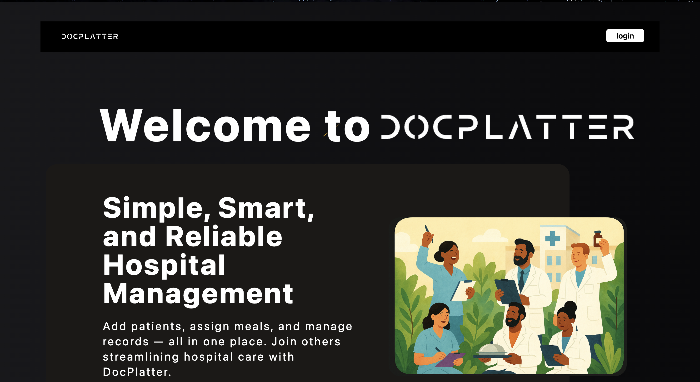

<h1 align="center">Docplatter</h1>

<p align="center">
  Docplatter is a simple yet powerful patient meal management system.
.<br />
  It allows managers to register patients and assign meals scheduled for specific dates and times, helping healthcare providers organize and track meal plans efficiently.
  <br />
  🚧 Note: This project is actively under development — more features and improvements are being added!
  <br />
<a href="https://docplatter-jatinmehta.vercel.app/"><strong>🔗 Live Demo</strong></a> |
<a href="https://github.com/JatinMehta007/Docplatter"><strong>🧠 Source Code</strong></a>
</p>

---

## ✨ Features
	•	➕ Add new patients
	•	🍽️ Assign meals to patients
	•	📅 Schedule meals with date and time
	•	🗂️ Organized management for easy tracking
	•	🛠️ Continuous improvements and upcoming features

---

## 📚 Tech Stack
	•	Frontend: (React / Tailwind)
	•	Backend: (Node.js / Express)
	•	Database: ( PostgreSQL / neon )

---

## Usage

1. 👤 **Add Patient:**  
   Register a patient by entering their name.

2. 🍽️ **Assign Meal:**  
   Choose a meal and schedule it with a date and time.

---

## Screenshots

 
---

## Future Plans 🚀
	•	Notifications/reminders for scheduled meals
	•	Patient dietary restrictions and allergies
	•	Reports and analytics dashboard
	•	UI/UX improvements
	•	Mobile responsiveness
	•	Better search and filter options

---

## 🚀 Installation

Clone the repository:

```bash
git clone https://github.com/JatinMehta007/Docplatter
cd Docplatter
npm install
npm start
